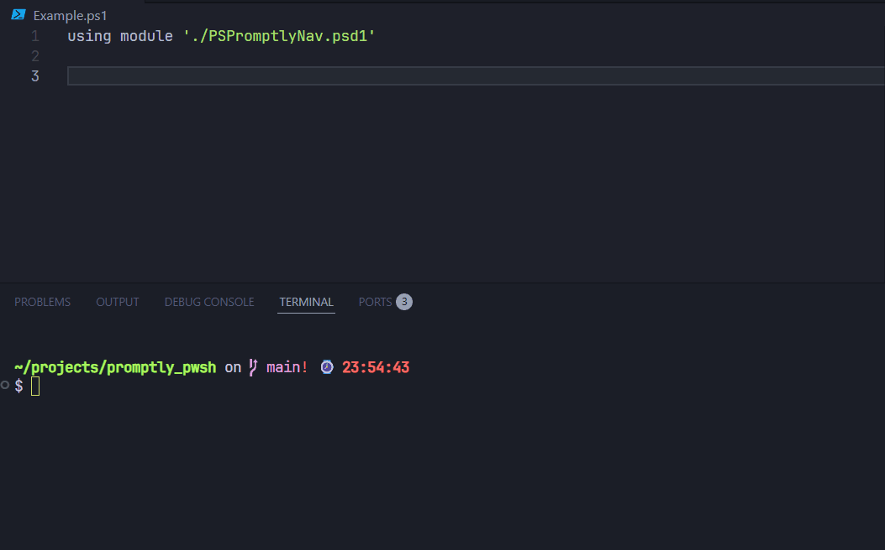

# Promptly

> PowerShell framework for creating command-line automations.


---

## 📖 Overview

**Promptly** is a framework that assists in creating **interactive command-line applications**.

It was designed to be **modular, extensible, and user-friendly**, allowing independent commands used in everyday applications to compose a complete application with minimal code.

---
## 🐈 Example

Watch this demonstration of how to use the framework below.




---

## ✨ Resources

- 🧭 Creating declarative menus 
- 🎨 Support for flexible **themes and layouts**  
- ↗️ Input capture via keyboard (arrow keys, Enter, Esc, etc.) 
- 🧩 Object-oriented structure with `Menu` and `MenuItem` classes.  
- 🧱 Extensible for larger systems (e.g., automation CLI)  

---

## 📦 Instalation

Install directly from the **PowerShell Gallery** (when published):

```powershell
Install-Module -Name PSPromptlyNav -Scope CurrentUser
